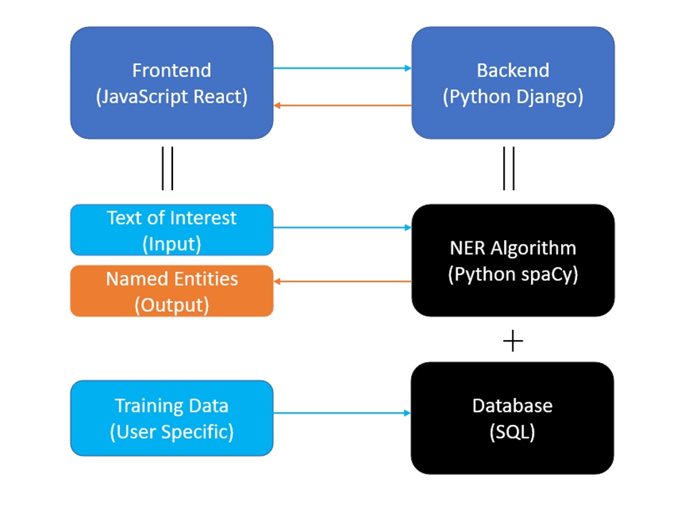

### Named Entity Recognition Tool

#### Pitch

When searching for literatures, it can be very time consuming to read through every literature found, especially for international students. This application will give the key words of provided text file to help users to understand the content of file in a shorter time.

#### Functionality

1. Users can upload their interested texts to the website.
2. Users can get the named entities of the input text.
3. Users can select which named entities they would like to see.
4. Users can upload their training dataset to self-train the algorithm.
5. Users’ future use will be helped by their submitted training data.

#### Components

We will separate our web application into two primary parts: frontend and backend. For the backend, we will be using Python Django web framework, and for the frontend, we will be using React JavaScript, as well as the basic languages like HTML and CSS. Below are the details of our components.

**Backend**: Python with the Django framework. 

- One main reason for choosing python is that three members of our team are familiar with Python. It is easy to learn and use and has a large ecosystem of libraries and packages.

- We will be using Python Django web framework, which is a widely used web framework for backend. We will be using the python spaCy library, which is an open-source library for Natural Language Processing (NLP) in Python. spaCy provides algorithms for Named Entity Recognition (NER), which is the core concept of our project. Using spaCy, we will implement an NER algorithm that will detect named entities from a given data, such as txt files, strings, csv files. From there, we will output the detected named entities (stored as json file) to the frontend, which will then present the information to the users.

- We will start with the Python Wikipedia library, a library that allows us to obtain and parse data from Wikipedia. This library will be used for testing purposes, specifically to see if:

  1. The backend NER algorithm has been correctly implemented.
  2. The backend server can successfully receive requests and send information.
  3. The implementation identifies the named entities with high accuracy.

  Once we are finished with the testing procedure, we will move on to connecting the frontend with the backend. We may create a SQL database with the goal of allowing users to self-train the NER algorithm by providing their own training data text.

**Frontend**: React framework using JavaScript (or TypeScript), HTML, CSS

- We will implement the frontend using JavaScript programming language and the React framework. JavaScript is a popular scripting language used for web development. It allows us to create dynamically updating content easily. We will be using React, a JavaScript library, to create our user interface for the website even faster.
- We will implement an interface where users can put in their text and trigger the webpage to send information to the backend, where our implemented NER algorithm with detect named entities, and return back the entities to the webpage. 

#### Teamwork

All of us will be using vscode text editor, in order to have similar working environment. We will create a git repository, so a team member can push his or her parts of codes into it, and pull other team member’s parts from it. Git also have version control functionality, so we can recover past codes in case a problem occurs.

We will have a meeting every Sunday 3 pm, online or in person depending on the explicit situation. During the meeting, we shall report the work we have done in the past week, the issues we have encountered, and determine the tasks to be done in the coming week. If any of us have an infraction, a vote should be made to decide whose opinion we should listen to.

The program has two major parts, frontend and backend, so we will be working on the application in 2 teams of 2 persons. Linjia and Yuxuan will be developing the backend, since they have learned and are familiar with Python. Kangyu and Boning will be working on the front end. Although they do not know too much about React and JavaScript, they know more than the other team. Also, they have both expressed interests in learning React, JavaScript, and frontend developing.

#### Risks

1. We are not able to implement NER algorithm to the backend.

   This is the core part of our project. We could not get into any other steps for the backend if we cannot fix it. We would like to learn from examples from others' open source, or maybe ask help from our mentor. We can try to work on frontend-backend connection before finishing this part. There will be a longer time for backend implementation and move the frontend-backend connection to earlier stage.

2. We fail to connect backend and frontend to transfer data.

   This is also a core part of our project. The solution will be similar to the previous risk. We might want to begin the training part earlier.

3. We are not able to transform user input training data into SQL form.

   This is not the core feature of our project. We can have some alternative to get a similar result. One is that we can create a "feedback" feature that allows users to evaluate each return keywords and create SQL format at the backend. Adding a new evaluation tab is not hard, so if we have no progress until a week before the deadline, we would like to switch to this alternative.

#### Schedule

We will have our meeting on Sunday 3 PM - 4 PM each week. During the meeting, team members will share the project progress and questions during programming. We divide our task into five parts, and we set the checkpoint about every two weeks.

| Week |                       Task Description                       |
| :--: | :----------------------------------------------------------: |
|  1   | Design User Interface; Confirm the required libraries for the project and install them; Set up GitHub Repo |
|  2   | Start to set up the frontend and build the main page for our Application |
|  3   | Test the NER algorithm in Python for a specific website (Wikipedia) for backend |
|  4   |    Design the result panel for Wikipedia for the frontend    |
|  5   | Implement web Crawler in the backend and prepare for using NER algorithm given arbitrary website |
|  6   | Create Login Page in the frontend; Create the Database for users in GCP |
|  7   |            Connect the database with the backend             |
|  8   | Integrate the application; Add creative functions based on our project progress |

#### Continuous Integration

##### Test Library

For now, we have decided to use Python to write our backend. We will use `unittest` library to debug and test our code. Here is the [link](https://docs.python.org/3/library/unittest.html) for more information. 

##### Style Guide

For the naming of variables and functions, we will follow the [Camel Case](https://en.wikipedia.org/wiki/Camel_case). Since most of us will work using Visual Studio Code, here is an automation [tool](https://marketplace.visualstudio.com/items?itemName=maptz.camelcasenavigation) called Camel Case Navigation in VS code to check Camel Case.

##### Test Coverage

In the `unittest` library, there is unittest coverage command to generate a test coverage report. Here is the [tutorial](https://www.pythontutorial.net/python-unit-testing/python-unittest-coverage/).

##### Pull Request Workflow 

We divide our team into a frontend group, and a backend group and both groups have two team members.  If someone needs to create a PR, the other person on the same team needs to review the PR and provide feedback. If the reviewer cannot handle this PR, the other team will help to review it. In our weekly meeting, we will assign tasks to each team member that works on different parts of the project to avoid merge conflicts. 