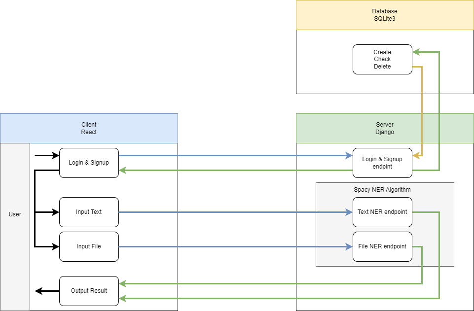

# Named Entity Recognition Tool

### Introduction

When searching for literatures, it can be very time consuming to read through every literature found, especially for international students. This application will give the key words of provided text file to help users to understand the content of file in a shorter time.  

Users will be able to provide custom text into the input textbox and obtain a result that has the named entities of the given text. Users can switch between providing custom text or Wikipedia topics. Users can also upload files containing the text they wish to analyze. Our application will receive whatever text the user provides and generate satisfying named entities.

For more details, view the full project proposal [here](https://github.com/CS222-UIUC/course-project-team-42/blob/main/ProjectProposal.md).

### Technical Architecture



### Developers

 - __Boning Wang, Linjia Long__  
Frontend. React JavaScript, HTML, CSS, request connections.
 - __Kangyu Feng, Yuxuan Chen__  
Backend. Python Django web framework, SQLite3 Database, SpaCy NER Algorithms, request connections.

### Environment Setup

#### Initial Installation
 - Backend
```
pip3 install pipenv                       //Python pipenv packaging tool 

pipenv install django                     //Python django framework
pipenv install django-cors-headers

pipenv install wikipedia                  //Python wikipedia module

pipenv install spaCy                      //Python SpaCy Library
python -m spacy download en_core_web_sm
python -m spacy download zh_core_web_sm
python -m spacy download es_core_news_sm
```
 - Frontend
```
node js  
https://nodejs.org/en/download/

react js  
https://reactjs.org/docs/getting-started.html

npm install                             //React node modules
npm install cors
npm install axios
```

#### Running application
To start the application, you should start the backend Server and frontend Client.
 - Backend
```
pipenv shell
cd NamedEntityRecognitionTool
python manage.py runserver              //make sure to be in the same directory as Server (NamedEntityRecognitionTool)
```
 - Frontend
```
cd entity_recognition
npm start                               //make sure to be in the same directory as Client (entity_recognition)
```
